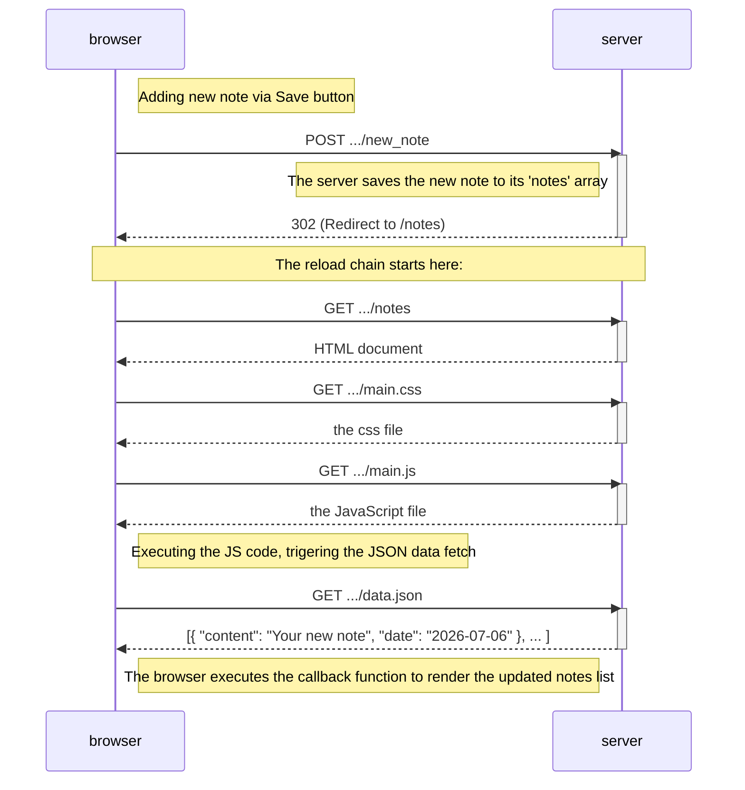

```mermaid
sequenceDiagram
    participant browser
    participant server

    Note right of browser: Adding new note via Save button

    browser->>server: POST .../new_note
    activate server
    Note left of server: The server saves the new note to its 'notes' array
    server-->>browser: 302 (Redirect to /notes)
    deactivate server

    Note over browser, server: The reload chain starts here:

    browser->>server: GET .../notes
    activate server
    server-->>browser: HTML document
    deactivate server

    browser->>server: GET .../main.css
    activate server
    server-->>browser: the css file
    deactivate server

    browser->>server: GET .../main.js
    activate server
    server-->>browser: the JavaScript file
    deactivate server

    Note right of browser: Executing the JS code, trigering the JSON data fetch

    browser->>server: GET .../data.json
    activate server
    server-->>browser: [{ "content": "Your new note", "date": "2026-07-06" }, ... ]
    deactivate server

    Note right of browser: The browser executes the callback function to render the updated notes list
```
