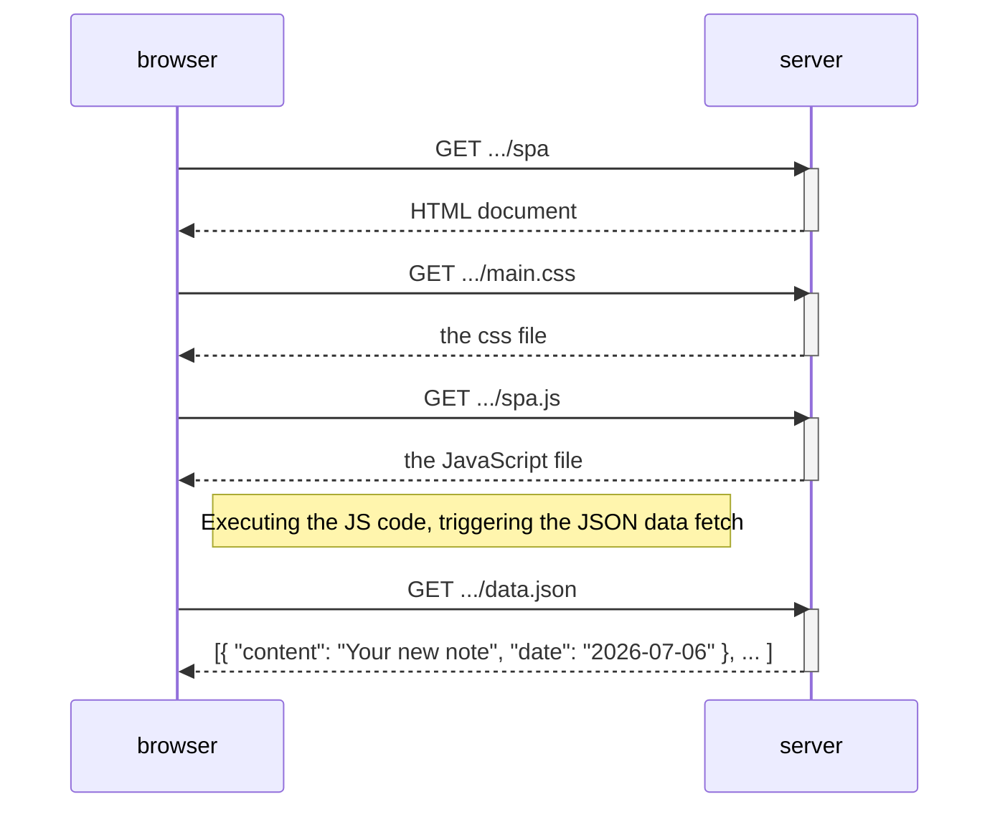

```mermaid
sequenceDiagram
    participant browser
    participant server

    browser->>server: GET .../spa
    activate server
    server-->>browser: HTML document
    deactivate server

    browser->>server: GET .../main.css
    activate server
    server-->>browser: the css file
    deactivate server

    browser->>server: GET .../spa.js
    activate server
    server-->>browser: the JavaScript file
    deactivate server
    
    Note right of browser: Executing the JS code, triggering the JSON data fetch

    browser->>server: GET .../data.json
    activate server
    server-->>browser: [{ "content": "Your new note", "date": "2026-07-06" }, ... ]
    deactivate server
 
```
